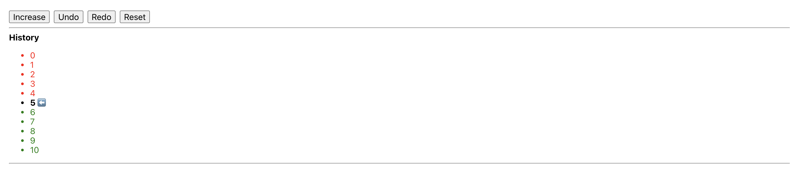

<div align="center">
  <h1 align="center">
    useMementoState
  </h1>
</div>

<div align="center">

A React hook that keeps the track of the history of the state changes.

[](https://github.com/mimshins/utilityjs/blob/main/LICENSE)
[](https://www.npmjs.com/package/@utilityjs/use-memento-state)
[](https://www.npmjs.com/package/@utilityjs/use-memento-state)
[](https://www.npmjs.com/package/@utilityjs/use-memento-state)

```bash
npm i @utilityjs/use-memento-state | yarn add @utilityjs/use-memento-state
```

</div>

<hr>

<p align="center">
  
</p>

<hr>

## Usage

```tsx
const MementoDemo = () => {
  const {
    state,
    setState,
    pastStates,
    futureStates,
    redo,
    undo,
    reset
  } = useMementoState(0);

  return (
    <React.Fragment>
      <button onClick={() => void setState(v => v + 1)}>Increase</button>
      <button onClick={() => void undo()}>Undo</button>
      <button onClick={() => void redo()}>Redo</button>
      <button onClick={() => void reset()}>Reset</button>
      <hr />
      <strong>History</strong>
      <ul>
        {pastStates.map(past => (
          <li style={{ color: "red" }} key={past}>
            {past}
          </li>
        ))}
        <li style={{ color: "#000", fontWeight: "bold" }}>
          {state}{" "}
          <span role="img" aria-label="Arrow">
            ⬅️
          </span>
        </li>
        {futureStates.map(future => (
          <li style={{ color: "green" }} key={future}>
            {future}
          </li>
        ))}
      </ul>
    </React.Fragment>
  );
};
```

## API

### `useMementoState(initialPresent)`

```ts
interface Mementos<T> {
  state: T;
  pastStates: T[];
  futureStates: T[];
  setState: React.Dispatch<React.SetStateAction<T>>;
  undo: () => void;
  redo: () => void;
  reset: () => void;
  hasPastState: () => boolean;
  hasFutureState: () => boolean;
}
declare const useMementoState: <T>(initialPresent: T) => Mementos<T>;
```

#### `initialPresent`

The value of the initial present state.

